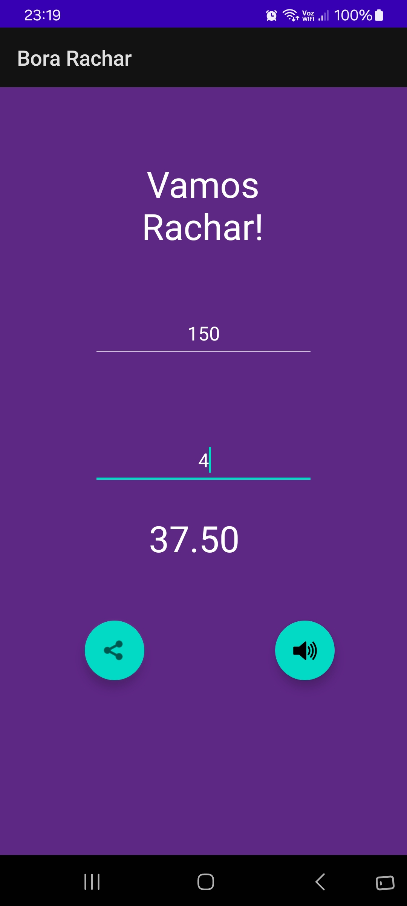

# Bora Rachar!

Este projeto é a atividade 2 da disciplina de Programação para Dispositivos Móveis (SMD0122) da UFC.

O Bora Rachar tem como objetivo facilitar a hora de dividir a conta no restaurante com amigos. Basta inserir o valor total da conta e a quantidade de pessoas na mesa e o app irá calcular a conta individual de cada um.

    

## O que foi implementado
Os seguintes pontos da atividade foram implementados:

- Divisão da conta pelo número de pessoas;
- Ícone personalizado;
- Permite compartilhar o valor da conta dividido em apps de mensagem;
- Falar o valor calculado com Text-to-Speech (TTS);
- O cálculo é atrelado a mudança de valores nos campos, portanto não é necessário clicar em um botão para calcular.